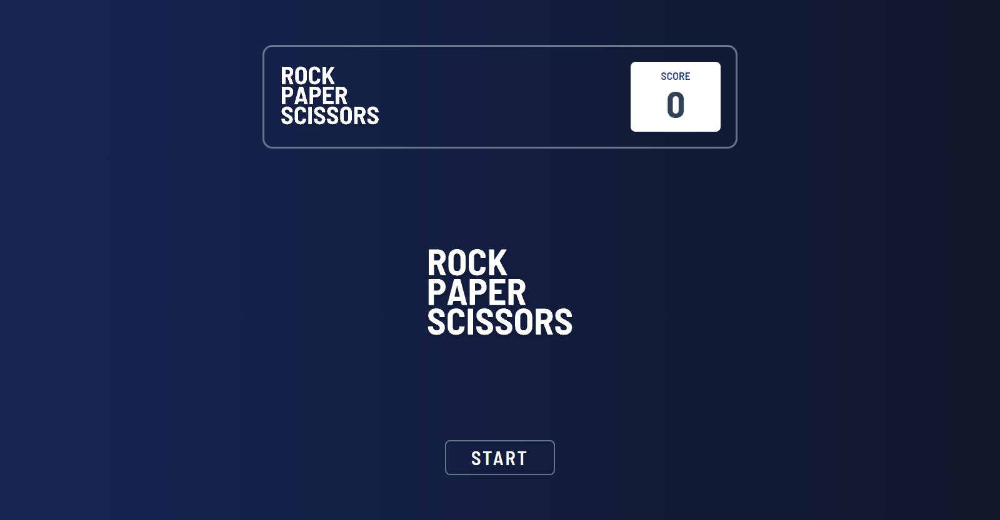
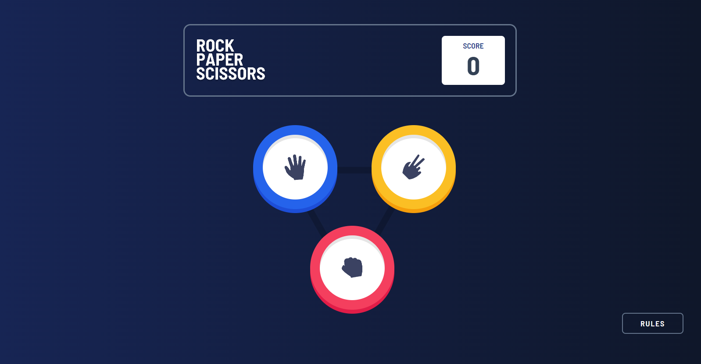
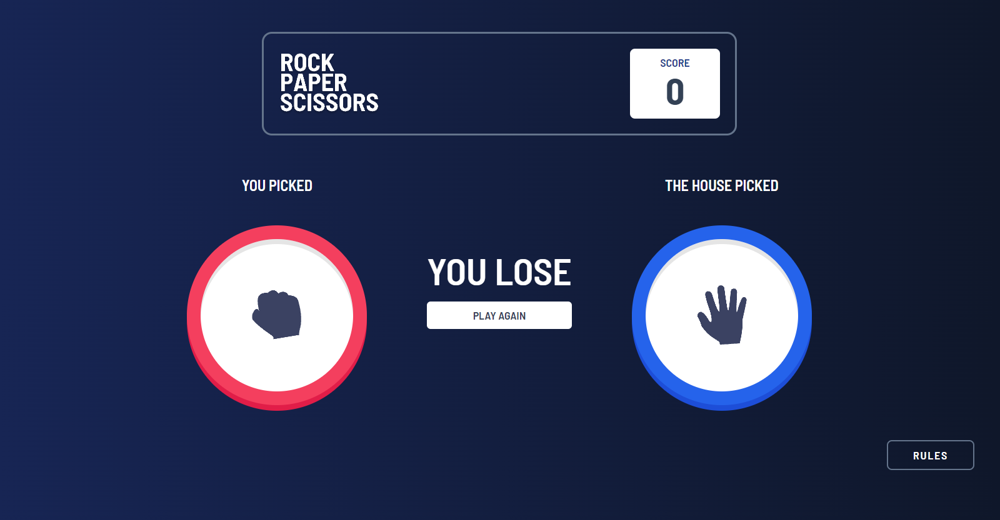
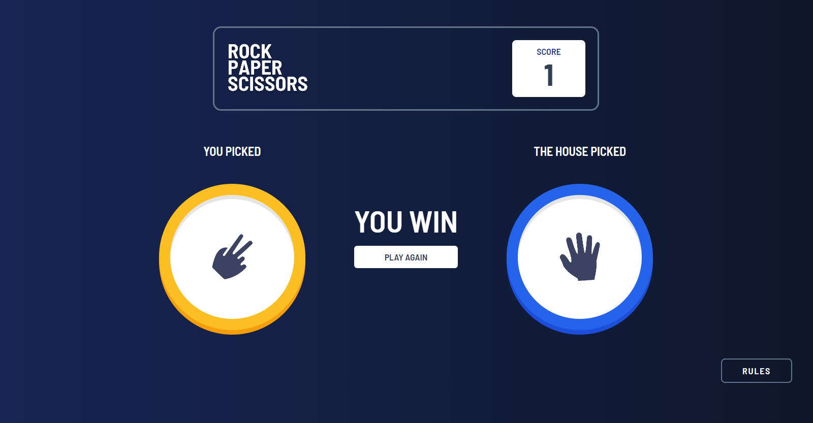
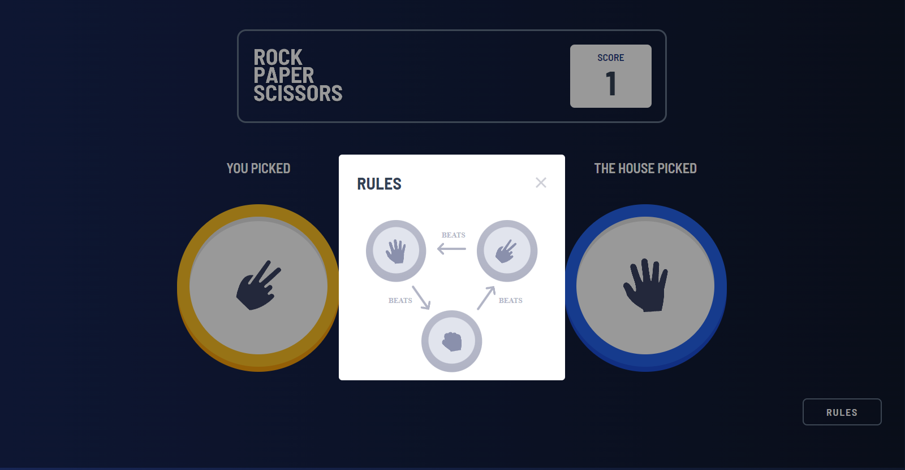

# ✊✋✂  ROCK PAPER SCISSORS 

My version of the Front end mentor challenge : ROCK PAPER SCISSORS
https://www.frontendmentor.io/challenges/rock-paper-scissors-game-pTgwgvgH


## Run Locally

Clone the project

```bash
  git clone https://github.com/Khaledik/rock-paper-scissors
```


## Tech Stack

**Client:** HTML, Tailwind, Javascript


## Font

| Font            | Weight                                                                |
| ----------------- | ------------------------------------------------------------------ |
| Barlow Semi Condensed | 600 |
| Barlow Semi Condensed | 700 |

## Color Reference

| Color             | Hex                                                                |
| ----------------- | ------------------------------------------------------------------ |
| slate-700 |   #334155 |
| rose-500 |   #f43f5e |
| blue-600 |  #2563eb |
| amber-400 |  #fbbf24 |


## Screenshots







